# Crowdin Translation Status Badge

A GitHub Action that generates a single SVG "status card" showing per-language
translation progress for a Crowdin project — one card, every language, at a
glance.



## Usage
> [!Important]
> It is strongly advised to use a fixed version number or a fixed commit hash
```yaml
name: Update Crowdin translation badge

on:
  schedule:
    - cron: "0 4 * * *"
  workflow_dispatch: {}

permissions:
  contents: write

jobs:
  update-badge:
    runs-on: ubuntu-latest
    steps:
      - uses: actions/checkout@3d3c42e5aac5ba805825da76410c181273ba90b1 # V7.0.1

      - uses: SeaweedbrainCY/crowdin-badge-action@<latest_tag_or_association_commit_sha1>
        with:
          crowdin_token: ${{ secrets.CROWDIN_TOKEN }}
          crowdin_project_id: ${{ secrets.CROWDIN_PROJECT_ID }}
          crowdin_project_id: 10
          # output_path: badges/crowdin-status.svg   # optional, this is the default

      - name: Commit if changed
        run: |
          if git diff --quiet -- badges/crowdin-status.svg; then
            exit 0
          fi
          git config user.name "github-actions[bot]"
          git config user.email "github-actions[bot]@users.noreply.github.com"
          git add badges/crowdin-status.svg
          git commit -m "chore: update Crowdin translation status badge"
          git push
```

Then embed the generated file in your README:

```md

```

## Inputs

| Input                 | Required | Default                     | Description                                              |
|------------------------|----------|------------------------------|------------------------------------------------------------|
| `crowdin_token`        | yes      | —                             | Crowdin API token with read access to the project.        |
| `crowdin_project_id`   | yes      | —                             | Numeric Crowdin project ID.                                |
| `output_path`          | no       | `badges/crowdin-status.svg`  | Where to write the generated SVG, relative to the workspace. |

## Outputs

| Output     | Description                    |
|------------|---------------------------------|
| `svg_path` | Path of the generated SVG file. |

## Why this exists

Crowdin's built-in badge only shows one overall percentage for the whole
project. The community "Badges & Status Images" marketplace app does
per-language charts, but the generated images are unstyled and occasionally
go offline. This action generates the SVG itself, once, and commits it
straight into your own repo — no third-party image host in the loop.
